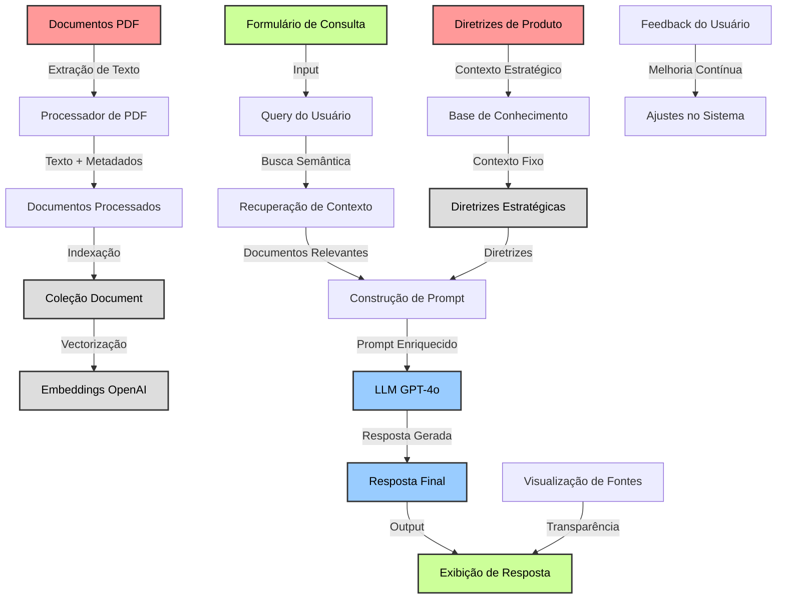

# Agente IA para Ideação e Discovery de Produto

Este repositório contém o código-fonte para um agente de IA especializado em Ideação e Discovery de Produto, utilizando LLM, Base vetorial, frameworks de orquestração, ingestão de dados e interface Streamlit.

## Arquitetura do Sistema

O diagrama abaixo ilustra a arquitetura completa do agente e como os diferentes componentes se conectam:



## Fluxo Detalhado de Ferramentas e Técnicas

Este guia apresenta passo a passo as ferramentas e técnicas utilizadas em cada etapa do agente, facilitando a replicação do sistema.

### 1. Ingestão de Dados

#### Processamento de Documentos PDF
- **Ferramenta**: poppler-utils (pdftotext)
- **Técnica**: Extração de texto com layout preservado
- **Arquivo**: `src/ingest/pdf_extractor.py`
- **Processo**: Os documentos PDF são processados usando a ferramenta pdftotext do pacote poppler-utils, que extrai o texto mantendo o layout original do documento.

#### Extração de Metadados
- **Ferramenta**: Python (biblioteca os, subprocess)
- **Técnica**: Extração de metadados via pdfinfo
- **Processo**: Metadados como título, autor, data de criação e número de páginas são extraídos usando o comando pdfinfo e armazenados junto com o texto.

#### Processamento de Diretrizes
- **Ferramenta**: Markdown
- **Arquivo**: `data/diretrizes_produto.md`
- **Processo**: As diretrizes estratégicas de produto são mantidas em formato Markdown para fácil edição e são carregadas como contexto fixo para o agente.

### 2. Chunking e Processamento

#### Divisão em Chunks
- **Ferramenta**: Python (data_ingestion.py)
- **Técnica**: Chunking de texto em segmentos menores
- **Processo**: O texto extraído é dividido em chunks menores para melhorar a precisão da recuperação semântica.

#### Enriquecimento com Metadados
- **Ferramenta**: Python (dicionários e estruturas de dados)
- **Técnica**: Associação de metadados a cada chunk
- **Processo**: Cada chunk recebe metadados como origem do documento, posição no texto original e tipo de conteúdo.

#### Serialização
- **Ferramenta**: Python (json)
- **Técnica**: Serialização em formato JSON
- **Processo**: Os chunks processados são serializados em arquivos JSON para armazenamento intermediário e posterior indexação.

### 3. Indexação Vetorial

#### Configuração do Schema
- **Ferramenta**: Weaviate Python Client
- **Técnica**: Definição de classes e propriedades
- **Arquivo**: `src/rag/weaviate_integration.py`
- **Processo**: Um schema é criado no Weaviate definindo a estrutura dos dados, incluindo propriedades como conteúdo, tipo, autor e metadados.

#### Indexação em Lote
- **Ferramenta**: Weaviate Batch API
- **Técnica**: Processamento em lotes para eficiência
- **Processo**: Os documentos são enviados em lotes para o Weaviate, otimizando o processo de indexação.

#### Vectorização
- **Ferramenta**: OpenAI Embeddings API
- **Técnica**: Geração de embeddings vetoriais
- **Processo**: O texto de cada chunk é convertido em vetores de alta dimensão usando o modelo de embeddings da OpenAI (text-embedding-ada-002).

#### Armazenamento
- **Ferramenta**: Weaviate Cloud
- **Técnica**: Armazenamento em base vetorial
- **Processo**: Os vetores e metadados são armazenados no Weaviate Cloud, permitindo buscas semânticas eficientes.

### 4. Recuperação e Geração

#### Busca Semântica
- **Ferramenta**: Weaviate Query API
- **Técnica**: Similaridade vetorial
- **Arquivo**: `src/rag/rag_integration.py`
- **Processo**: As consultas do usuário são convertidas em vetores e comparadas com os documentos indexados para encontrar os mais relevantes.

#### Construção de Prompt
- **Ferramenta**: Python (rag_integration.py)
- **Técnica**: Injeção de contexto e diretrizes
- **Processo**: Um prompt é construído combinando a consulta do usuário, os documentos recuperados e as diretrizes estratégicas.

#### Geração de Resposta
- **Ferramenta**: OpenAI API (GPT-4o)
- **Técnica**: Geração de texto com contexto enriquecido
- **Processo**: O prompt enriquecido é enviado ao modelo GPT-4o, que gera uma resposta contextualizada e alinhada com as diretrizes.

### 5. Interface do Usuário

#### Formulário de Consulta
- **Ferramenta**: Streamlit
- **Técnica**: Componentes interativos
- **Arquivo**: `src/ui/app.py`
- **Processo**: Um formulário Streamlit captura as consultas do usuário e as envia para processamento.

#### Exibição de Resultados
- **Ferramenta**: Streamlit Markdown
- **Técnica**: Formatação de texto e expansores
- **Processo**: As respostas geradas são exibidas em formato Markdown, com seções expansíveis para mostrar as fontes utilizadas.

#### Sistema de Feedback
- **Ferramenta**: Streamlit Components
- **Técnica**: Botões de feedback e armazenamento
- **Arquivo**: `src/ui/feedback_manager.py`
- **Processo**: Os usuários podem fornecer feedback sobre a utilidade das respostas, que é armazenado para melhorias futuras.

### 6. Deploy e Monitoramento

#### Versionamento
- **Ferramenta**: GitHub
- **Técnica**: Controle de versão Git
- **Processo**: Todo o código é versionado no GitHub, facilitando colaboração e rastreamento de alterações.

#### Automação de Deploy
- **Ferramenta**: GitHub Actions
- **Técnica**: CI/CD automatizado
- **Arquivo**: `.github/workflows/main.yml`
- **Processo**: Um pipeline de CI/CD automatiza testes e deploy quando alterações são enviadas ao repositório.

#### Hospedagem
- **Ferramenta**: Render
- **Técnica**: Serviço web gerenciado
- **Arquivo**: `render.yaml`
- **Processo**: A aplicação é hospedada no Render, que gerencia a infraestrutura e escalabilidade.

#### Monitoramento
- **Ferramenta**: Render Dashboard e Logs
- **Técnica**: Logging estruturado
- **Processo**: Logs detalhados são gerados e monitorados através do dashboard do Render para identificar problemas e otimizar performance.

## Componentes Principais

### Ingestão de Dados
- Processamento de documentos PDF
- Extração de texto e metadados
- Integração de diretrizes estratégicas de produto

### Base Vetorial (Weaviate)
- Armazenamento e indexação de documentos
- Vectorização de conteúdo usando OpenAI
- Busca semântica para recuperação de contexto

### RAG (Retrieval Augmented Generation)
- Recuperação de documentos relevantes
- Construção de prompts enriquecidos com diretrizes
- Geração de respostas contextualizadas via GPT-4o

### Interface do Usuário (Streamlit)
- Formulário para consultas em linguagem natural
- Exibição de respostas e fontes utilizadas
- Mecanismo de feedback para melhoria contínua

## Estrutura do Projeto

```
DiscoveryRAGAgent/
├── data/
│   ├── raw/            # Documentos originais (PDFs)
│   ├── processed/      # Documentos processados (JSON)
│   └── diretrizes_produto.md  # Diretrizes estratégicas
├── src/
│   ├── ingest/         # Módulos de ingestão de dados
│   ├── rag/            # Módulos de RAG e integração com LLM
│   ├── ui/             # Interface Streamlit
│   └── utils/          # Utilitários e funções auxiliares
├── docs/               # Documentação
└── tests/              # Testes automatizados
```

## Tecnologias Utilizadas

- **LLM**: OpenAI GPT-4o
- **Base Vetorial**: Weaviate Cloud
- **Framework de Orquestração**: LangChain
- **Interface**: Streamlit
- **Linguagem**: Python 3.8+

## Instalação e Uso

Instruções detalhadas para instalação e uso estão disponíveis no documento `docs/guia_utilizador.md`.

## Status do Projeto

Este projeto está pronto para deploy. Todos os componentes foram implementados e testados com sucesso.
